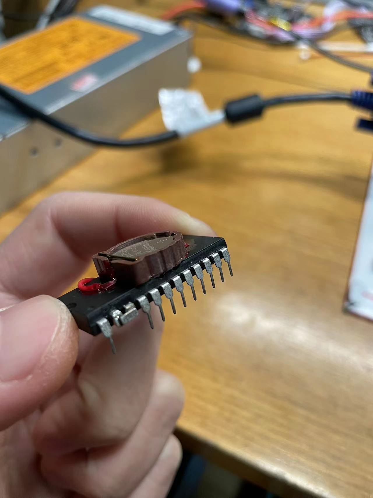
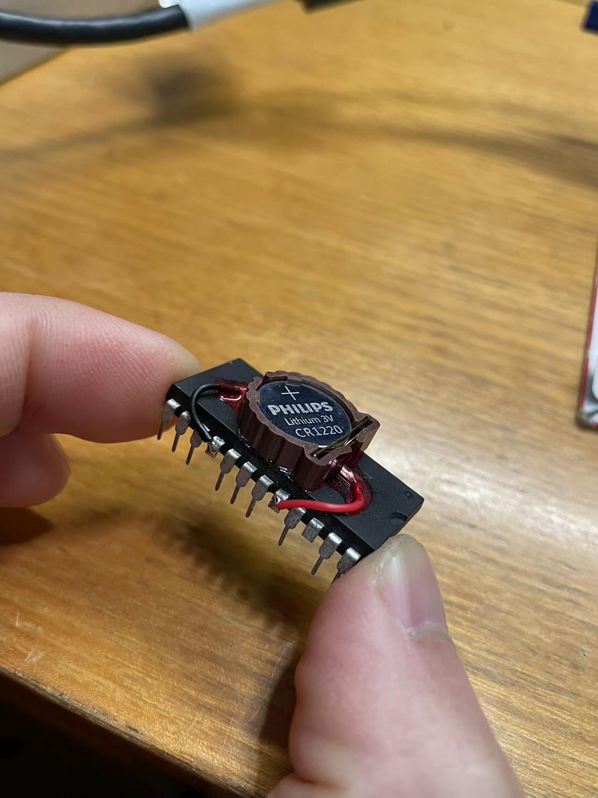
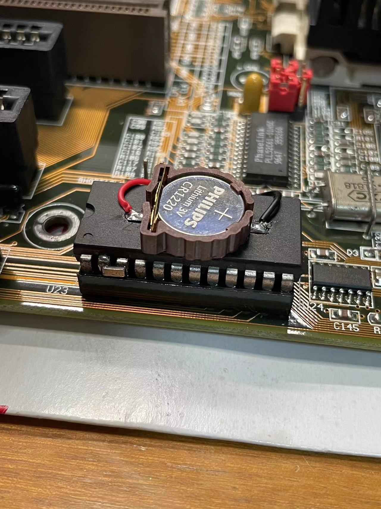

# ds12b887/ds12887
### Drop in replacement for DS12B887/DS12887/DS12887A RTC chip solution  

#### Why BQ3285EP?  

First, BQ3285EP is pin compatible with DS12B887/DS12887. The same for 5v VCC and a 3v battery as backup power for the internal circuit. Refer to [BQ3285E.pdf](bq3285e.pdf)  

Secondly, BQ3285EP is a DIP-24 RTC chip which exactly same as DS12B887/DS12887. That means you don't need a PCB or adapter to make it fit into the slot of original one.  

Third, BQ3285EP is a slim chip that's lower than DS12B887 once you put it in position. So it would be easy to put a battery tray on top of it. Some solutions on the internet tried to add an extra battery tray on top of the DS12B887/DS12887 which makes it even thicker. Then it may cause some issues on the motherboard when you want to use a ISA card.  

#### How to make it?  

##### Material  
32.768khz/6pF quartz crystal  
battery tray, CR1220 or CR2032  

##### Steps
1. Connect the crystal between pin-2 and pin-3
2. Connect the battery positive to pin-20 (BC) and negitive to pin-16(VSS)
3. Cut pin-22

That's it!  

#### Final Product

